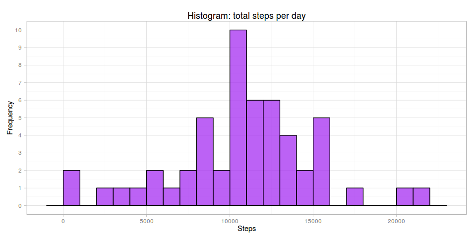
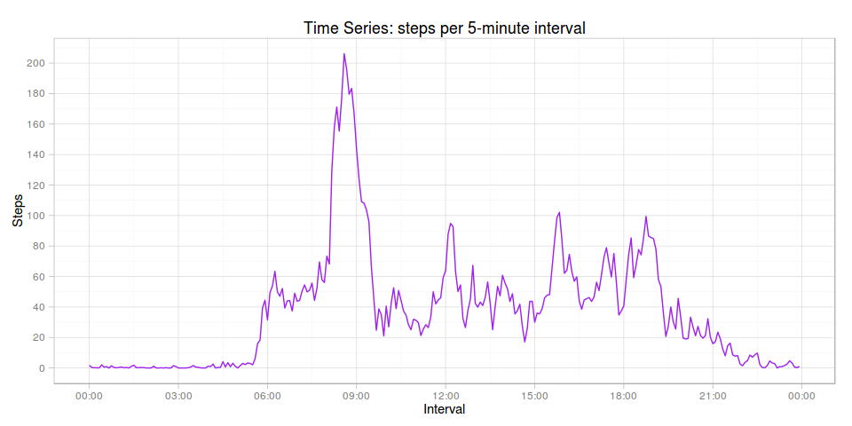
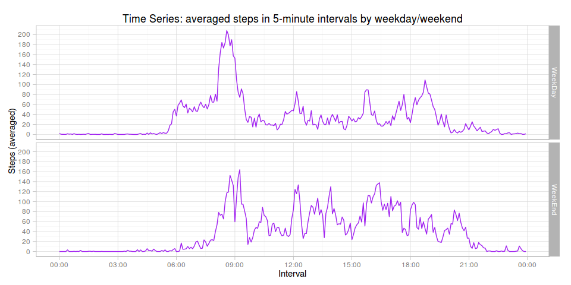

# Reproducible Research: Peer Assessment 1

## Introduction

It is now possible to collect a large amount of data about personal movement
using activity monitoring devices such as a Fitbit, Nike Fuelband, or Jawbone
Up. These type of devices are part of the “quantified self” movement – a group
of enthusiasts who take measurements about themselves regularly to improve
their health, to find patterns in their behavior, or because they are tech
geeks. But these data remain under-utilized both because the raw data are hard
to obtain and there is a lack of statistical methods and software for
processing and interpreting the data.

This assessment makes use of data from a personal activity monitoring device.
This device collects data at 5-minute intervals through out the day. The data
consists of two months of data from an anonymous individual collected during
the months of October and November, 2012 and include the number of steps taken
in 5-minute intervals each day.

## Data

The data can be downloaded from the course web site:

* Dataset: [Activity monitoring data](https://d396qusza40orc.cloudfront.net/repdata%2Fdata%2Factivity.zip) [52K]

The variables included in this dataset are:

* **steps**: Number of steps taking in a 5-minute interval (missing
    values are coded as `NA`)

* **date**: The date on which the measurement was taken in `YYYY-MM-DD`
    format

* **interval**: Identifier for the 5-minute interval in which
    measurement was taken

The dataset is stored in a comma-separated-value (`CSV`) file and there are a 
total of 17,568 observations in this dataset.

For convience the raw dataset is included in this repository.

## Loading and preprocessing the data

Ensure that we show all our working and set global defaults:

```r
require(knitr)
require(utils)
require(ggplot2)
require(scales)
require(dplyr)
opts_chunk$set(echo = TRUE, cache = TRUE, cache.path = "cache/", fig.width = 10, fig.path = "figure/")
```

Load data into a data frame:

```r
# unzip overwriting existing directory to ensure clean setup
if (!file.exists("activity.csv")) {
    # download archive into local directory
    zipFileName <- file.path("activity.zip")
    if (!file.exists(zipFileName)) {
        zipUrl <- "https://d396qusza40orc.cloudfront.net/repdata%2Fdata%2Factivity.zip"
        download.file(zipUrl, destfile = zipFileName, method = "curl", mode = "wb")
        print(paste(Sys.time(), "archive downloaded"))
    }
    # unpack archive
    unzip(zipFileName, overwrite = FALSE)
    print(paste(Sys.time(), "archive unpacked"))
}

# load into data frame and convert date column to date
data <- read.csv("activity.csv", stringsAsFactors = FALSE)
data <- transform(data, date = as.Date(data$date, "%Y-%m-%d"))
```

## What is mean total number of steps taken per day?


```r
# what period does the data cover?
fromDate <- format(min(data$date), "%a %b %d, %Y")
toDate <- format(max(data$date), "%a %b %d, %Y")
```

Total the number of steps taken each day during the two month period  
from **Mon Oct 01, 2012** to **Fri Nov 30, 2012**.  
This excludes days for which no steps data was recorded.


```r
dailyTotals <- aggregate(steps ~ date, data, FUN = sum)

# calculate mean and median from daily totals
stepsMean <- prettyNum(mean(dailyTotals$steps), big.mark=",")
stepsMedian <- prettyNum(median(dailyTotals$steps), big.mark=",")
```

The mean number of steps was **10,766.19** per day.  
The median number of steps was **10,765** per day. 

Show a histogram of the frequency of total steps:


```r
dailyTotals %>%
    ggplot(aes(steps)) + 
    geom_histogram(binwidth = 1000, fill = "purple", colour = "black", alpha = 0.7) +
    theme_light(base_family = "Avenir", base_size = 11) +
    scale_y_continuous(breaks = pretty_breaks(10)) +
    labs(x = "Steps") +
    labs(y = "Frequency") +
    ggtitle("Histogram: total steps per day")
```

 

## What is the average daily activity pattern?

Average the number of steps taken across all days:


```r
intervalTotals <- aggregate(steps ~ interval, data, FUN = mean)

# what was interval containing the maximum number of steps?
maxStepsInterval <- intervalTotals[which.max(intervalTotals$steps), "interval"]
```

The 5-minute interval which on average across all the days in the dataset 
contains the maximum number of steps is **835**. This peak is 
shown in the time series (line) plot of the 5-minute intervals and the number of
steps taken averaged across all days:


```r
intervalTotals %>%
    ggplot(aes(interval, steps)) + 
    geom_line(colour = "purple") +
    theme_light(base_family = "Avenir", base_size = 11) +
    scale_x_discrete(breaks = pretty_breaks(15)) +
    scale_y_continuous(breaks = pretty_breaks(10)) +
    labs(x = "Interval") +
    labs(y = "Steps") +
    theme(legend.position = "none") +
    ggtitle("Time Series: steps per 5-minute interval")
```

 

## Imputing missing values

Note that there are a number of days/intervals where there are missing values
(coded as `NA`). The presence of missing days may introduce bias into some
calculations or summaries of the data.


```r
ms <- sum(is.na(data$steps))
ts <- length(data$steps)
missingSteps <- prettyNum(ms, big.mark = ",")
totalSteps <- prettyNum(ts, big.mark = ",")
percentSteps <- percent(ms/ts)
```

There are **2,304** of **17,568** rows without step values,
which is around **13.1%**.

We will impute missing steps using the _median_ for that _weekdays_ 5-minute 
interval. That is, we are modelling against similar activity for that time 
interval for that day of week. Here, we are making the assumption that activity
for a day is much the same: one Monday looks like any other Monday. To do this
we must first calculate the median by weekday and 5-minute time interval:


```r
# create key "dayint" used for matching against data, where day is a weekday
intervalsByDay <- data %>%
    mutate(dayint = paste0(format(date, "%a"), formatC(interval, flag = "0", width = 4))) %>%
    select(dayint, steps) %>%
    group_by(dayint) %>%
    summarise(median = as.integer(median(steps, na.rm = TRUE)))
```

Now we can merge the median by day as an additional column. Then it is easy to
impute the missing steps using the median for that weekdays 5-minute interval:


```r
# create a key field to use for merging with intervalsByDay
# merge via left join median for days interval into data frame (this adds a median column)
# where steps is missing (NA) use the median of the weekday interval
# select only required columns
imputedData <- data %>%
    mutate(dayint = paste0(format(date, "%a"), formatC(interval, flag = "0", width = 4))) %>%
    select(dayint, date, interval, steps) %>%
    left_join(y = intervalsByDay, by = "dayint") %>%
    mutate(steps = ifelse(is.na(steps), median, steps)) %>%
    select(date, interval, steps)
```

Further analysis will use these imputed results. Firstly, summarise the total
number of steps taken per day, and show the total step frequency in a histogram:


```r
dailyImputedTotals <- aggregate(steps ~ date, imputedData, FUN = sum)

# calculate mean and median from daily imputed totals
stepsMean <- prettyNum(mean(dailyImputedTotals$steps), big.mark=",")
stepsMedian <- prettyNum(median(dailyImputedTotals$steps), big.mark=",")
```

The mean number of steps was **9,704.656** per day.  
The median number of steps was **10,395** per day. 

Notice that imputed data shows an increase in frequency of lesser steps. This
has the side-effect of reducing the mean step count per day, while essentially
leaving the median step count unchanged.


```r
dailyImputedTotals %>%
    ggplot(aes(steps)) + 
    geom_histogram(binwidth = 1000, fill = "purple", colour = "black", alpha = 0.7) +
    theme_light(base_family = "Avenir", base_size = 11) +
    scale_y_continuous(breaks = pretty_breaks(10)) +
    labs(x = "Steps") +
    labs(y = "Frequency") +
    ggtitle("Histogram: total imputed steps per day")
```

 

## Are there differences in activity patterns between weekdays and weekends?

Using imputed data compare weekday activity to weekends:


```r
# create a factor for weekday / weekend
# format %u gives weekday as a decimal number (1–7, Monday is 1)
# so weekdays are when %u = 1..5, weekends when %u = 6, 7
imputedWeekDayData <- imputedData %>%
    mutate(weekday = factor(ifelse(format(date, "%u") < 6, "WeekDay", "WeekEnd"))) %>%
    select(weekday, interval, steps) %>%
    group_by(weekday, interval) %>%
    summarise(average = mean(steps))
```

The following time series plot shows the 5-minute interval by weekday/weekend:


```r
imputedWeekDayData %>%
    ggplot(aes(x = interval, y = average)) + 
    geom_line(colour = "purple") +
    theme_light(base_family = "Avenir", base_size = 11) +
    scale_x_discrete(breaks = pretty_breaks(15)) +
    scale_y_continuous(breaks = pretty_breaks(10)) +
    labs(x = "Interval") +
    labs(y = "Steps (averaged)") +
    facet_grid(weekday ~ .) +
    ggtitle("Time Series: averaged steps in 5-minute intervals by weekday/weekend")
```

 

The average of steps by weekday is higher in the morning, possibly indicating
that the individual was active earlier during a weekday. Also, on weekends,
there appears to be more activity throughout the day.
